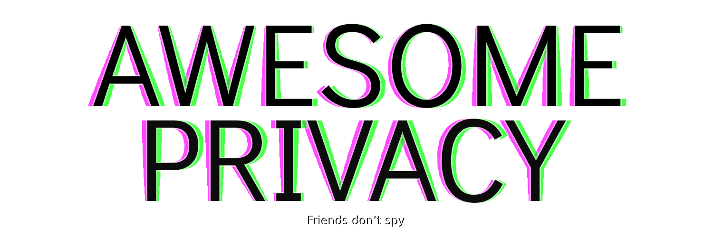

 </img>
 

List of free,open source and privacy respecting services and alternatives to privative services.

<a href="https://github.com/pluja/awesome-privacy/blob/main/misc/ABOUT.md"> About </a> 

* [Search Engines](#search-engines)
* [Photo Storage](#photo-storage)
* [Photo Management](#photo-management)
* [Cloud Storage](#cloud-storage)
* [Encryption](#encryption)
* [File management / sharing](#file-sharing)
* [Maps / Navigation](#maps--navigation)
* [Translation](#translation)
* [Android Keyboard](#android-keyboard)
* [Social Networks](#social-networks)
  * [Instagram](#instagram)
  * [Youtube](#youtube)
  * [Twitter](#twitter)
  * [Reddit](#reddit)
  * [Streaming Platforms (Twitch)](#streaming-platforms)
* [Teamworking and Communication Tools](#teamworking-tools)
* [Instant Messaging](#instant-messaging)
* [Password Managers](#password-managers)
* [Video conferencing](#video-conferencing)
* [Fitness and Health](#fitness-and-health)
* [Media Streaming Platforms](#media-streaming-platforms)
  * [Video/Audio](#video-audio)
  * [Audio](#audio)
  * [Podcasts](#podcasts)
* [Operating Systems](#operating-systems)
  * [Android](#android-1)
  * [Smart TV](#smart-tv)
  * [PC](#PC)
* [Analytics](#analytics)
* [Cloaking](#cloaking)
* [Office](#office)
* [Uncategorized](#uncategorized)

## Search Engines

 </img> **AVOID**
* Google Search
* Yahoo Search
* Bing
* Yandex

 </img>  **Instead use:**
* [Whoogle Search](https://github.com/benbusby/whoogle-search) - A self-hosted, ad-free, privacy-respecting Google metasearch engine.
* [Qwant](https://www.qwant.com/) - A privacy oriented search engine made in France with no tracking.
* [SearX](https://searx.me/) - Privacy-respecting metasearch engine.

## Photo storage
 </img> **AVOID**
* Google Photos
* Amazon Photos

 </img>  **Instead use:**
* [Stingle Photos](https://stingle.org/) - Open source solution that provides strong security, privacy and encryption to backup your photos.
* [Crypt.ee](https://crypt.ee/) - A private and encrypted place for all your photos, documents, notes and more.
* [Photoprism](https://photoprism.app) - Feature rich server-based application for browsing, organizing and sharing your personal photo collection. The most similar to Google Photos.
* [Photostructure](https://photostructure.com/) - Self-hosted photo library that makes browsing and sharing a lifetime of memories delightful.
* [LibrePhotos](https://github.com/LibrePhotos/librephotos) - Active [OwnPhotos](https://github.com/hooram/ownphotos) fork. Self hosted alternative to Google Photos.
* [Nextcloud](https://nextcloud.com/) - The open source self-hosted productivity platform that keeps you in control. It has a [*Photos*](https://github.com/nextcloud/photos) plugin to help you organize and visualize your photos.

## Photo management
 </img> **AVOID**:
* Adobe Photoshop / Illustrator / Lightroom
* VSCO

 </img>  **Instead use:**
#### Desktop:
* [GIMP](https://www.gimp.org/) - The Free & Open Source Image Editor.
* [Krita](https://github.com/KDE/krita) - Krita is a free and open source digital painting application

#### Android:
* [PocketPaint](https://github.com/Catrobat/Paintroid) - The standard image manipulation app for Catroid.
* [Scrambled Exif](https://gitlab.com/juanitobananas/scrambled-exif) - Remove Exif data from pictures before sharing them.
* [ImagePipe](https://codeberg.org/Starfish/Imagepipe) - Reduces image size and removes exif-tags when sharing images on android devices.

## Encryption
Remember: Without strong encryption, you will be spied on systematically by lots of people.

* [Veracrypt](https://www.veracrypt.fr/en/Home.html) - VeraCrypt is a free open source disk encryption software for Windows, Mac OSX and Linux.
* [Hat.sh](https://hat.sh/) - A Free, Fast, Secure and Serverless File Encryption.
* [Cryptomator](https://cryptomator.org/) - Cryptomator encrypts your data quickly and easily. Afterwards you upload them protected to your favorite cloud servic
* [Stegcloak](https://stegcloak.surge.sh/) - Hide secrets with invisible characters in plain text securely using passwords.

## File Sharing
 </img> **AVOID**:
* WeTransfer
* SendAnywhere

 </img> **Instead Use:**
* [Lufi](https://framagit.org/fiat-tux/hat-softwares/lufi) - Let's Upload that FIle — File sharing software.
* [Croc](https://github.com/schollz/croc) - Easily and securely send things from one computer to another.
* [Dat-cp](https://github.com/tom-james-watson/dat-cp) - Copy files between hosts on a network using the peer-to-peer Dat network.
* [QRcp](https://github.com/claudiodangelis/qrcp) - Transfer files over wifi from your computer to your mobile device by scanning a QR code without leaving the terminal.
* [Snapdrop](https://snapdrop.net/) - A Progressive Web App for local file sharing inspired by Apple's Airdrop.
* [Paperless](https://github.com/the-paperless-project/paperless) - Scan, index, and archive all of your paper documents.
* [Tresorit](https://send.tresorit.com/) - Free, End-to-end encrypted alternative for file sending. Up to 5GB.

## Cloud Storage
 </img> **AVOID**
* Google Drive
* Dropbox
* OneDrive

 </img>  **Instead use:**
* [Nextcloud](https://nextcloud.com/) - The open source self-hosted productivity platform that keeps you in control.
* [Seafile](https://www.seafile.com/en/home/) - High performance file syncing and sharing. It includes a Wiki, WYSIWYG editing and other knowledge management features.

**Other useful tools**:
* [Cryptomator](https://cryptomator.org) - Cryptomator encrypts your data quickly and easily. Afterwards you upload them protected to your favorite cloud service.
* [Syncthing](https://syncthing.net/) - Continuous file synchronization program. It synchronizes files between two or more computers in real time, safely protected from prying eyes.
* [Rclone](https://rclone.org/) - Rclone is a command line program to manage files on cloud storage. It is a feature rich alternative to cloud vendors' web storage interfaces and like the tools listed above enables encryption for encrypting files in the cloud. 

## Maps / Navigation
 </img> **Avoid**:
* Google Maps
* Apple Maps
* Yandex Maps
* Bing Maps
* Waze
* Sygic
* HERE WeGo

 </img> **Instead Use:**
* [Open Street Map (OSM)](https://www.openstreetmap.org/) - OpenStreetMap is built by a community of mappers that contribute and maintain data about roads, trails, cafés, railway stations, and much more, all over the world.
  * [OSMAnd](https://osmand.net/) - Android/iOS Navigation app using OSM. It is a feature-rich app with all you expect.

## Translation
 </img> **Avoid**:
* Google Translate
* DeepL
* Bing Translator

 </img> **Instead Use:**
* [Libretranslate](https://libretranslate.com/) - Open Source Machine Translation - 100% Self-Hosted. No Limits. No Ties to Proprietary Services.
* [Apertium](https://apertium.org/) - A free/open-source machine translation platform.
* [Softcatala](https://www.softcatala.org/traductor/) - Open Source Translation tool - Only Catalan/Spanish/English/French.

## Android Keyboard
 </img> **Avoid**:
* GBoard (Google)
* SwiftKey

 </img> **Instead Use:**
* [OpenBoard](https://github.com/dslul/openboard) - 100% FOSS keyboard, based on AOSP.
* [FlorisBoard](https://github.com/florisboard/florisboard) - An open-source keyboard for Android. Currently in alpha/early-beta stage.
* [AnySoftKeyboard](https://anysoftkeyboard.github.io/) - The only Android keyboard you'll ever need. Free as in speech and Free as in beer.

## Mail Services

## Operating Systems
### Android
 </img> Try to avoid using Google Android or any Android that has been modified and tuned by any manufacturer such as Xiaomi, Huawei, Samsung, etc. Android is an Open Source project - [AOSP - Android Open Source Project]() - and it has many versions that will respect the user privacy and data and won't share it with private servers from manufacturers or service providers.

 </img> **Instead Use:**

#### Android app compatibility
* [GrapheneOS](https://grapheneos.org/) - GrapheneOS is an open source privacy and security focused mobile OS with Android app compatibility. 
* [CalyxOS](https://calyxos.org/) - CalyxOS lets you have your cake and eat it too, with  "Privacy by Design".
* [LineageOS](https://lineageos.org/) - A free and open-source operating system for various devices, based on the Android mobile platform.
* [Replicant](https://www.replicant.us/) - A free software mobile operating system putting the emphasis on freedom and privacy/security.

#### Based on Linux
* [UBPorts](https://www.ubports.com/) - Ubuntu Touch is the touch-friendly mobile version of Ubuntu.
* [postmarketOS](https://postmarketos.org/) - Touch optimised and pre-configured version of Alpine Linux.
* [PureOS](https://www.pureos.net/) - Operating system developed by purism for the Librem 5.
* [Plasma Mobile](https://www.plasma-mobile.org/) - Plasma, in your pocket. Privacy-respecting, open source and secure phone ecosystem.

### Smart TV
 </img> Don't use Android TV, LG WebOS or any other privacy-invasive common TV OS that comes preinstalled with your TV.

 </img> **Instead Use:**
* [Kodi](https://kodi.tv/) - It is an entertainment hub that brings all your digital media together into a beautiful and user friendly package. It is 100% free and open source, very customisable and runs on a wide variety of devices.
* [Jellyfin](https://jellyfin.org/) - Jellyfin is the volunteer-built media solution that puts you in control of your media. Stream to any device from your own server, with no strings attached.
* [OSMC](https://osmc.tv/) - OSMC is a free and open source media center built for the people, by the people.
* [RaspberryCast](https://github.com/vincelwt/RaspberryCast) - Transform your Raspberry Pi into a streaming device. Cast videos from mobile devices or computers to your TV.

### PC
 </img> Don't use MS Windows.

 </img> **Instead Use:**
* [GNU/Linux](https://www.linux.com/what-is-linux/) - GNU/Linux is a family of mostly free and open source Operating Systems mostly developed by the community. If you don't know where to start, [Linux-Mint(Cinnamon)](https://linuxmint.com/edition.php?id=281) is a beginner friendly Distribution. If you want to try it out without installing it to your computer, you can use a [Live USB Stick](https://www.fosslinux.com/274/how-to-create-linux-mint-live-usb-drive-on-windows.htm). If you want to install Linux but keep your current operating System, you can set up [dual boot](https://averagelinuxuser.com/dualboot-linux-windows/).

## Social Networks
### Instagram
 </img> Don't use instagram (or at least the official client). Instagram is a very privacy-invasive app with biased results and feeds based on user profiles, it is also used as a manipulation tool and has a lot of censorship going against free speech. Lastly, it has an addictive and toxic ui-design.

 </img> **Instead Use:**

**Alternatives to Instagram**:
* [Pixelfed](https://pixelfed.org/) - Decentralized, federated and Open Source alternative to Instagram with posts, videos, stories, tags, etc.

**Alternative Instagram clients**:
* [Barinsta](http://barinsta.austinhuang.me/) - The beautiful, open source, and privacy-friendly alternative Instagram client for Android.
* [Bibliogram](https://bibliogram.art/) - Watch Instagram's public profile in a friendlier page that loads faster, gives downloadable images, eliminates ads and doesn't urge you to sign up.

### Youtube
 </img> Don't use YouTube (or at least the official client). Youtube is very privacy invasive, it generates a very accurate profile based on your interests. Also it is a [radicalization tool](https://www.pcmag.com/news/does-youtubes-algorithm-lead-to-radicalization) which shows [biased content to users](https://arxiv.org/pdf/1908.08313.pdf) in order to get more engadgement and to get them to watch more and more content creating an [adiction](https://medium.com/dataseries/how-youtube-is-addictive-259d5c575883). It never shows you [alternative opinions](https://arxiv.org/pdf/1908.08313.pdf) to your ideology/bias. Youtube censors a lot. Youtube collects a LOT of your data: interesnts, free time, ideology, likes, dislikes, music taste, etc...

 </img> **Instead Use:**
* [Peertube](https://joinpeertube.org/en/) - A free, open and decentralized alternative to video platforms.
* [LBRY](https://lbry.tv/) - LBRY is a secure, open, and community-run digital marketplace. Enjoy the latest content from your favorite creators - as a user, not a product.
* [Odysee](https://odysee.com/) - Odysee is a video platform backed by the creators of lbry and uses the lbry blockchain protocol.
* [DTube](https://github.com/dtube/dtube) - A full-featured video sharing website, decentralized.

 </img> **Privacy respecting Youtube clients:**
- [Yotter](https://github.com/ytorg/yotter) - Youtube and Twitter with privacy. Never share any of your data to Youtube, yet be able to watch Youtube videos.
- [Invidious](https://github.com/iv-org/invidious) - Alternative and privacy respecting Youtube frontend.
- [FreeTube](https://github.com/FreeTubeApp/FreeTube) - FreeTube is an open source desktop YouTube player built with privacy in mind. (Uses Local RSS API or Invidious for backend)
- [NewPipe](https://newpipe.net/) - Alternative android Youtube app. No account needed, privacy respecting. **Shares IP with Youtube**

#### Worth mentioning:
- [Piped](https://github.com/TeamPiped) - Work in progress.

### Twitter
 </img> Avoid using Twitter official app / website. It tracks users and creates user profiles based on what they follow, retweet and like. Twitter harms and vulnerates users privacy with their policies.

 </img> **Alternatives to Twitter:**

> **Federated social networks**: A federated social network isn’t a single website like Twitter or Facebook, it's a network of thousands of communities operated by different organizations and individuals that provide a seamless social media experience.

* [Pleroma](https://pleroma.social/) - Pleroma is a free, federated social networking server built on open protocols.
  * [Soapbox](https://gitlab.com/soapbox-pub/soapbox-fe) - A frontend for Pleroma with a focus on custom branding and ease of use.
* [Mastodon](https://joinmastodon.org/) - Free, federated microblogging social network built on open protocols.

 </img> **Alternative Twitter Frontends:**
* [Nitter](https://github.com/zedeus/nitter/wiki/Instances) - Nitter is a free and open source alternative Twitter front-end focused on privacy.
* [Yotter](https://github.com/ytorg/yotter) - Twitter with privacy with a simple yet beautiful UI.

### Reddit
 </img> Try to avoid using Reddit or at least avoid their official clients as they are plenty of trackers, ads and share unnecessary user data with their servers.

 </img> **Reddit alternatives:**
* [Lemmy](https://join.lemmy.ml/) - A federated and open alternative to reddit in rust.
* [Aether](https://getaether.net/) - Peer-to-peer ephemeral public communities.
* [SaidIt](https://saidit.net/) - Open source Reddit clone.
* [Ruqqus](https://ruqqus.com) - Open source Reddit alternative without censorship.

 </img> **Privacy respecting Reddit clients:**
* [Libreddit](https://libredd.it) - Private Reddit front-end written in Rust 
* [Teddit](https://teddit.net/) - Alternative Reddit front-end focused on privacy
* [Infinity](https://github.com/Docile-Alligator/Infinity-For-Reddit) - A beautiful Reddit client for Android.
* [Slide](https://github.com/ccrama/Slide) - Slide is an open sourced, ad free Reddit browser for Android and iOS.

### Streaming Platforms
 </img>  Avoid using platforms as Twitch, Patreon, Youtube as they are very privacy-invasive with your viewers (and you!). Instead, you can try using some self-hosted platforms that do take care of everyone's privacy.

 </img> **Alternatives:**
- [Owncast](https://github.com/owncast/owncast) - Take control over your live stream video by running it yourself. Streaming + chat out of the box.

## Teamworking Tools
 </img> **AVOID**:
* Slack
* Google Hangouts
* Microsoft Teams
* Discord

 </img>  **Instead use:**
* [Zulip](https://zulip.com/) - Chat for distributed teams.
* [Twake](https://twake.app/) - Work in a team faster. Twake covers all of your organizational needs through a single platform.
* [RocketChat](https://rocket.chat/) - Control your communication, manage your data, and have your own collaboration platform to improve team productivity.
* [Nextcloud Talk](https://nextcloud.com/talk/) - Keep conversations private with Nextcloud Talk.
* [Mattermost](https://mattermost.com/) - Open-source Slack alternative.

## Instant Messaging
**Check out [this site](https://www.securemessagingapps.com/) for comparisons*

 </img> **AVOID**:
* Whatsapp
* Instagram DM
* Facebook Messenger
* Skype
* Zoom
* Google Hangouts / Chat

 </img>  **Instead use:**
* [Signal](https://signal.org/) - Extreme focus on privacy, combined with all of the features you expect. Strong encryption by design.
  * [Molly](https://github.com/mollyim/mollyim-android) - Signal-compatible fork client with some security enhancements.
* [Element](https://element.io/) - All-in-one secure chat app for teams, friends and organisations. Keeps conversations in your control, safe from data-mining and ads. Talk to everyone through the open global Matrix network, protected by proper end-to-end encryption.
* [Jabber / XMPP](https://xmpp.org/) - The universal messaging standard. Tried and tested. Independent. Privacy-focused.
  * [Conversations](https://conversations.im/) - Jabber/XMPP client for Android 4.0+ smartphones that has been optimized to provide a unique mobile experience
  * [AstraChat](https://astrachat.com/) - Another XMPP client.
* [Session](https://getsession.org/) - Extreme focus on privacy. Blockchain technology.
* [Status](https://status.im/) - Status is a secure messaging app, crypto wallet, and Web3 browser built with state of the art technology.
* [Tox](https://tox.chat/) - Tox is easy-to-use software that connects you with friends and family without anyone else listening in. 
* [Briar](https://briarproject.org/) - Peer-to-peer encrypted messaging and forums.
* [DeltaChat](https://delta.chat/) - Chat over encrypted e-mail.
* [Tinfoil Chat](https://github.com/maqp/tfc) - Onion-routed, endpoint secure messaging system.

#### Worth mentioning
* [Berty](https://berty.tech/) - Not released yet.
* [Telegram](https://telegram.org/) - Not fully open source. No E2E encryption by default on chats.

## Password Managers
 </img> **AVOID**:
* Lastpass
* Dashlane

 </img>  **Instead use:**
* [Bitwarden](https://bitwarden.com) - An open source cloud based password manager
* [KeepassXC](https://keepassxc.org/) - Securely store passwords using industry standard encryption, no sync just storage.
  * [KeepassDX](https://www.keepassdx.com/) for Android.
  * [Strongbox](https://strongboxsafe.com/) for iOS.
  * [KeeWeb](https://keeweb.info/) for Web and other platforms.
* [Padloc](https://padloc.app/) - The last password manager you'll ever want to use.

## Video Conferencing
 </img> **AVOID**:
* ZOOM
* Skype
* Google Meet
* Whatsapp
* Instagram
* Discord

 </img>  **Instead use:**
* [Jitsi Meet](https://meet.jit.si/) - More secure, more flexible, and completely free video conferencing. **No account needed, no installation needed**
* [Jami](https://jami.net/) - P2P audio and video conferences.
* [BigBlueButton](https://bigbluebutton.org/) - BigBlueButton is a web conferencing system designed for online learning.
* [PeerCalls](https://peercalls.com/) - Group peer to peer video calls for everyone written in Go and TypeScript.

## Fitness and Health
 </img> Your health is a **very** important piece of your **private data** and you should care **a lot** about it. Also, health related data is one of the most greeded. Please don't use apps from Google, Fitbit, Huawei, Xiaomi or any company that seeks the gathering of your personal data. 

If you need an app for **menstrual cycle tracking** please don't use any apps like Clue, Period Tracker, etc. Those cute pink apps are greedy for your menstrual cycle and intimate life data and will sell it for sure, protect your private life. Check the list below and you will find nice alternatives.

 </img>  **Instead use:**
* [wger](https://wger.de/en/software/features) - A free, open source, self-hosted web application that manages your exercises, workouts and nutrition.
* [Fitotrack](https://codeberg.org/jannis/FitoTrack) - A privacy oriented fitness tracker for Android.
* [OpenFoodFacts](https://world.openfoodfacts.org/) - Open Food Facts is a food products database made by everyone, for everyone. You can use it to make better food choices.
    * [OFF Apps](https://world.openfoodfacts.org/open-food-facts-mobile-app)
* [Drip](https://bloodyhealth.gitlab.io/) - Menstrual cycle and fertility tracking. Everything you enter stays on your device.
* [log28](https://github.com/wildeyedskies/log28) - a (very) simple no-frills period tracker for Android.

## Media Streaming Platforms
 </img> **AVOID**:
* Amazon Prime Video
* Netflix
* Disney+
* Plex
* Spotify
* Soundcloud

 </img>  **Instead use:**
#### Video/Audio:
* [Jellyfin](https://jellyfin.org/) - Jellyfin is the volunteer-built media solution that puts you in control of your media. Stream to any device from your own server, with no strings attached.
* [Streamio](https://www.stremio.com/) - Stremio is a modern media center that's a one-stop solution for your video entertainment.

#### Audio:
* [Funkwhale](https://funkwhale.audio/) - A social platform to enjoy and share music (Soundcloud alternative)
* [Subsonic](http://www.subsonic.org/pages/index.jsp) - Your complete, personal music streamer.
* [Koel](https://koel.dev/) - a personal music streaming server that works.
* [Nuclear](https://nuclear.js.org/) - Modern music player focused on streaming from free sources.
* [Navidrome](https://navidrome.org/) - Lightweight, fast and self-contained personal music streamer.

#### Podcasts
* [Antennapod](https://antennapod.org/) - The Open Podcast Player

## Analytics
 </img> Avoid any analytics service that comes from Google, Facebook, Microsoft or any privative service. These kind of analytics hurt the users privacy.

 </img>  **Instead use:**
* [Matomo](https://matomo.org/) - Google Analytics alternative that protects your data and your customers' privacy.
* [Plausible](https://plausible.io/) - Simple and privacy-friendly alternative to Google Analytics

## Cloaking
### Images
* [Fawkes](https://github.com/Shawn-Shan/fawkes) - privacy preserving tool against facial recognition systems.
  * [CloakMe](https://github.com/pluja/CloakMe) - Web interface for Fawkes algorithm.
* [ImageScrubber](https://github.com/everestpipkin/image-scrubber) - A friendly browser-based tool for anonymizing photographs taken at protests ([hosted version provided by everestpipkin](https://everestpipkin.github.io/image-scrubber/)).

### Text
* [Stegcloak](https://stegcloak.surge.sh/) - Hide secrets with invisible characters in plain text securely using passwords ([repo](https://github.com/kurolabs/stegcloak)).

## Office

 </img> **AVOID**
* Microsoft Office
* Google Docs

 </img>  **Instead use:**
* [LibreOffice](https://www.libreoffice.org/) - Free and open source offline office
* [OnlyOffice](https://www.onlyoffice.com/) - Free and open source online office for collaboration

## Uncategorized
* [Skymap](https://skymaponline.net/) - Open online planetarium program.
* [CrowdSec](https://github.com/crowdsecurity/crowdsec) - An open-source, modernized and collaborative fail2ban
* [Hetty](https://github.com/dstotijn/hetty) - Hetty is an HTTP toolkit for security research. It aims to be an open-source alternative to Burp Suite Pro.

