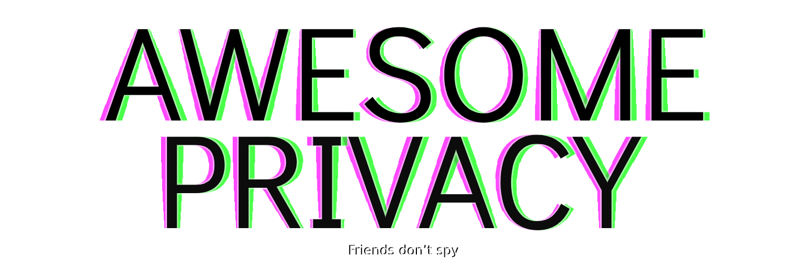

# Awesome Privacy

 </img>

	
	<a href="https://codeberg.org/pluja/awesome-privacy"></img></a>

List of free, open source and privacy respecting services and alternatives to privative services.

	<a href="https://github.com/pluja/awesome-privacy/blob/main/misc/ABOUT.md"> About </a> | 
	<a href="https://github.com/pluja/awesome-privacy/blob/main/misc/Contributing.md"> Contributing </a> | 
	<a href="https://github.com/pluja/awesome-privacy/blob/main/misc/QUOTES.md"> Quotes </a> | 
	<a href="https://github.com/pluja/awesome-privacy/discussions"> Discussions </a>

> [!IMPORTANT]
> Anonymity, Privacy, and Security are often used interchangeably, but they actually represent distinct concepts. It is important to understand the differences between them. [Read more in this section below](#privacy-vs-security-vs-anonymity).
> 
> The primary focus of this list is to provide alternatives that prioritize privacy. These alternatives give you control over your data and do not collect or sell it.

## Contents
- [2FA](#2fa)
- [Analytics](#analytics)
- [Android](#android)
  - [Android App Store](#android-app-store)
  - [Android Debloat Tools](#android-debloat-tools)
  - [Android Dialer](#android-dialer)
  - [Android File Manager](#android-file-manager)
  - [Android Gallery](#android-gallery)
  - [Android Keyboard](#android-keyboard)
  - [Android Launcher](#android-launcher)
- [Artificial Intelligence](#artificial-intelligence)
	- [ChatGPT](#chatgpt)
	- [AI Coding](#ai-coding)
	- [Text To Speech](#text-to-speech)
 	- [Speech To Text](#speech-to-text)
	- [Image Generation](#image-generation)
- [Bookmarking](#bookmarking)
    - [Book and web annotations](#book-and-web-annotationshighlights-management)
- [Captchas](#captchas)
- [Calendar](#calendar)
- [Commenting Engines (disqus)](#commenting-engines)
- [Cloaking](#cloaking)
- [Cloud Storage](#cloud-storage)
- [Creator Tools](#creator-tools)
- [Databases](#databases)
- [Dating Apps](#dating-apps)
- [Design Tools](#design-tools)
- [Developer Tools](#developer-tools)
    - [IDEs](#ides)
- [Dictation / ASR]()
- [Domain Registrar](#domain-registrar)
- [Download Manager](#download-manager)
- [Encryption](#encryption)
- [File Management and Sharing](#file-management-and-sharing)
- [Fitness and Health](#fitness-and-health)
	- [Fitness trackers](#fitness-trackers)
	- [Food](#food)
	- [Menstrual cycle trackers](#menstrual-cycle-trackers)
	- [Medical health](#medical-health)
- [Fonts](#fonts)
- [Forms](#forms)
- [Games](#games)
    - [Mario Kart](#mario-kart)
    - [Minecraft](#minecraft)
    - [Pokémon](#pokemon)
    - [Sonic the Hedgehog](#sonic-the-hedgehog)
- [Home Assistants](#home-assistants)
- [Instant Messaging](#instant-messaging)
- [Link in Bio Tools](#link-in-bio-tools)
- [Link Shorteners](#link-shorteners)
- [Location tracking](#location-tracking)
- [Mail Services](#mail-services)
- [Maps and Navigation](#maps-and-navigation)
- [Media Streaming Platforms](#media-streaming-platforms)
    - [Video and Audio](#video-and-audio)
    - [Audio](#audio)
    - [Podcasts](#podcasts)
- [Music Recognition (Shazam-like)](#music-recognition)
- [Notes and Tasks](#notes-and-tasks)
- [Office](#office)
- [Online Phone Providers (SMS)](#online-phone-providers)
- [Operating Systems](#operating-systems)
    - [Android](#android)
    - [PC / MacOS](#pc--macos)
    - [Smart TV](#smart-tv)
- [Password Managers](#password-managers)
- [Pastebin and Secret Sharing](#pastebin-and-secret-sharing)
- [Payments](#payments)
- [Personal Finances](#personal-finances)
	- [Full Featured Financial Management](#full-featured-financial-management)
 	- [Budget Management](#budget-management)
  	- [Shared Expenses](#shared-expenses)
	- [Others](#others)
 	- [Portfolio Trackers](#portfolio-trackers)
- [Photo Editing and Management](#photo-editing-and-management)
- [Photo Storage](#photo-storage)
- [Privacy Tools](#privacy-tools)
- [Remote Access and Control](#remote-access-and-control)
- [Search Engines](#search-engines)
- [Social Networks and Platforms](#social-networks-and-platforms)
    - [Blogging platforms (Medium / Blogger)](#blogging-platforms-medium)
    - [Imgur](#imgur)
    - [Instagram](#instagram)
    - [Quora](#quora)
    - [LBRY and Odysee](#lbry-and-odysee)
    - [Reddit](#reddit)
    - [Streaming Platforms (Twitch)](#streaming-platforms-twitch)
    - [TikTok](#tiktok)
    - [Twitter](#twitter)
    - [Wikipedia](#wikipedia)
    - [YouTube](#youtube)
- [Screen Recording](#screen-recording)
- [Teamworking Tools](#teamworking-tools)
- [Translation](#translation)
- [Uncategorized](#uncategorized)
- [Utilities](#utilities)
- [Version Control](#version-control)
- [Video and Audio Conferencing](#video-and-audio-conferencing)
- [Video Editing](#video-editing)
- [Virtual Private Networks (VPNs)](#VPNS)
- [Web Browser](#web-browser)
    - [Browser Addons](#browser-addons) 
    - [Browser Sync](#browser-sync)
    - [WebView](#webview)

## Notes and Tasks
⛔ **Avoid** 

These providers offer apps and services filled with data trackers. Also, most of them store your notes on their servers and do not offer any kind of encryption.

- Google Keep
    - [Google Keep Exporter](https://github.com/vHanda/google-keep-exporter) or [Keep To Markdown](https://github.com/erikelisath/keep-to-markdown) -  Convert your Google Keep notes into a standard markdown + YAML header format.
- Evernote
- Squid
- Notion
- OneNote

✅  **Instead use**

- [Anytype](https://www.anytype.io/) - An open-source Notion alternative. E2EE, cloud and local network sync, can be self-hosted.
- [AppFlowy](https://www.appflowy.io/) - Open Source Notion Alternative. You are in charge of your data and customizations.
- [HedgeDoc](https://hedgedoc.org/) - Formerly CodiMD. A real-time collaborative markdown notes app.
- [Joplin](https://github.com/laurent22/joplin) - Note taking and to-do application with synchronisation and encryption capabilities.
- [Logseq](https://logseq.com/) - Open-source, local-first, non-linear, outliner notebook for organizing and sharing your personal knowledge base.
- [Nextcloud Notes](https://github.com/nextcloud/notes/) - The Notes app is a distraction free notes taking app for Nextcloud.
	- [Nextcloud Notes app](https://github.com/stefan-niedermann/nextcloud-notes) - An android client for Nextcloud Notes.
- [Notally](https://github.com/OmGodse/Notally) - A beautiful notes app (local only, no sync).
- [Notevo](https://github.com/SamoTech/notevo) - Privacy-first, self-hostable Markdown notes app with AES-GCM client-side encryption, Laverna import support, tags, and zero telemetry. Offline-first, MIT licensed.
- [Notesnook](https://notesnook.com/) - Open source zero knowledge private note taking.
- [Obsidian](https://obsidian.md) - Obsidian is the private and flexible note‑taking app. Closed source but has no trackers (website / apps) and E2EE sync. 
- [Quillpad](https://quillpad.github.io/) - Take beautiful markdown notes and stay organized with task lists. Fork of Quillnote.
- [SiYuan](https://github.com/siyuan-note/siyuan) - A local-first personal knowledge management system.
- [Standard Notes](https://standardnotes.org/) - A free, open-source, and completely encrypted notes app.
- [Trilium Notes](https://github.com/zadam/trilium) - Trilium Notes is a hierarchical note taking application with focus on building large personal knowledge bases.
- [Turtl](https://turtlapp.com/) - Secure, collaborative notebook.
- [Vikunja](https://vikunja.io/) - The open-source, self-hostable to-do app.
- [WikiSuite](https://wikisuite.org/) - The most comprehensive and integrated Free / Libre / Open Source enterprise software suite.
- [XWiki](https://www.xwiki.org/xwiki/bin/view/Main/WebHome) - A generic wiki platform offering runtime services for applications built on top of it.

[Back to top 🔝](#contents)

